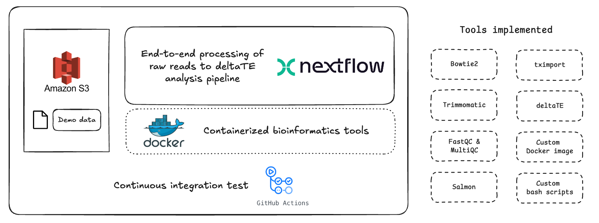
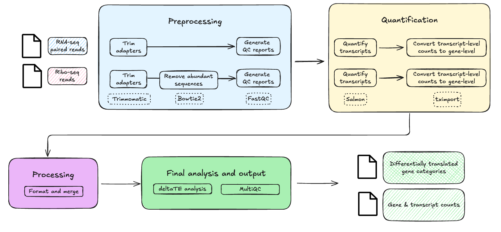

# A Pipeline for Performing Translational Efficiency Analysis From RNA-seq and Ribo-seq samples



[](…) [](https://emmanuel-tan.github.io/delta-te-pipeline/)

An automated Nextflow pipeline for translational efficiency (TE) analysis from RNA-seq + Ribo-seq.  
It takes raw FASTQs → contaminant removal → quantification → deltaTE → MultiQC, producing reproducible gene-level TE tables and QC reports.

# Introduction

Translational efficiency (TE), the ratio between ribosome occupancy (Ribo-seq) and transcript abundance (RNA-seq), is a critical layer of gene regulation. Shifts in TE are implicated in diverse biological processes, from stress responses and developmental programs to diseases such as cancer, heart failure, and neurodegeneration. 

Several tools exist for analyzing Ribo-seq and RNA-seq data together, but these are typically standalone R packages or scripts that require extensive preprocessing and custom formatting. 

In contrast, this pipeline provides an integrated, containerized, and fully automated workflow that starts from raw sequencing reads and delivers ready-to-analyze TE results using deltaTE. By combining Nextflow, Docker, and CI-based testing with GitHub Actions, it emphasizes reproducibility, modularity, and accessibility. 

## At a quick glance

### Features
- **Dual-modality**: RIBO (SE) + RNA (PE)
- **Contaminant removal**: Bowtie2 against rRNA FASTA
- **Fast quantification**: Salmon (pseudoalignment)
- **Reusable indices**: **Skip index** build via `--salmon_index`
- **Reproducible**: implemented using Docker containers
- **Discoverable results**: gene counts, deltaTE gene tables, MultiQC reports

### Implementation Highlights
- **Custom Nextflow modules**: Existing nf-core/Nextflow modules were adapted to fit the pipeline’s specific requirements; new modules were written where none existed.
- **Containerisation**: Pre-built Docker images were used whenever available for reproducibility. A custom Docker image was built for deltaTE to ensure consistent environments across runs.
- **CI-driven testing**: Each commit triggers a full demo run on GitHub Actions with reports automatically published to GitHub Pages.


### Demo Output and Generated Reports

As part of the continuous integration setup using Github actions, the pipeline is run on a demo dataset. The results can be viewed [in this repo](./test/example-results/deltaTE/output/), and the resulting MultiQC HTML report and Nextflow reports (a main report as well as timeline) are automatically published to [Github Pages](https://emmanuel-tan.github.io/delta-te-pipeline/) after a successful run.

# Workflow 



## Pipeline steps
1) Takes in single-end RPF and paired-end RNA
2) Removes contaminants (Bowtie2)
3) Quantifies with Salmon (optionally reusing a pre-built index)
4) Converts Salmon transcript counts to gene-level counts (tximeta/tximport + custom tx2gene)
5) Computes differentially translated genes with deltaTE
6) Aggregates QC with MultiQC

# Ways to run

## Demo Run

A demo run is completed automatically on this repo using Github Actions; the demo run can also be completed locally by pulling the repo, downloading the demo dataset, and running the pipeline using the profile `ci_demo`. 

### Automated demo run

On each push, GitHub Actions executes a full run of the pipeline. The workflow pulls a compact, public demo dataset from S3 (2 conditions × 3 replicates for both RNA-seq and Ribo-seq; ~1M reads per sample). To keep CI runtimes reasonable, quantification uses a reduced Salmon index built from a subset of the human transcriptome. 

This exercises every stage—Trimmomatic → rRNA contaminant removal (Bowtie2) → Salmon → tximeta/tximport → deltaTE → MultiQC—on a small but representative dataset.

After completing the pipeline, the Github Actions workflow publishes the reports which can be viewed [here](https://emmanuel-tan.github.io/delta-te-pipeline/).

It takes ~20-30 minutes to complete this run on the free Github Actions Ubuntu runner, which has [these specifications as stated by Github](https://docs.github.com/en/actions/reference/runners/github-hosted-runners#standard-github-hosted-runners-for-public-repositories). 

### Local demo run

> **⚠️ Caveats for local demo runs**
> 
> - The demo dataset is ~8 GB and may take a long time to download and extract.
> - Performance depends on your machine’s CPU architecture, RAM, and disk speed.
> - The pipeline is developed for AMD64/x86-64 but will run on Apple M-series Macs via QEMU (with the `arm` profile). Expect significantly longer runtimes.
> - On a 2020 M1 MacBook Air (8 GB RAM) the full demo takes several hours to complete.

*Nextflow and Docker should already be installed on your device*

**Pull the repo and change directory**

```bash
git clone https://github.com/emmanuel-tan/delta-te-pipeline.git
cd delta-te-pipeline
```

**Download demo data and references from S3 bucket**
```bash
# download the raw reads
curl -o "demo-v0.1.tar.zst" "https://delta-te-demo.s3.ap-southeast-1.amazonaws.com/public/demo-v0.1.tar.zst" 
# download the references
curl -o "demo-reference-v0.1.tar.zst" "https://delta-te-demo.s3.ap-southeast-1.amazonaws.com/public/demo-reference-v0.1.tar.zst"

# decompress and unzip to the expected path
zstd -dc demo-v0.1.tar.zst | tar -xvf - -C test/new_demo
zstd -dc demo-reference-v0.1.tar.zst | tar -xvf - -C test/new_demo
```

**Run the pipeline with the `ci_demo` profile**

```bash
nextflow run main.nf -profile ci_demo
# if running on a device with arm-based cpu architecture (such as an M1 Macbook), include the arm profile as well
nextflow run main.nf -profile ci_demo,arm
```

## Standard run 

To run this on your own data, the following parameters are expected. 

| Parameter | Expected input |
| --- | --- |
| `--adapters`              | path to `fasta` file containing adapter sequences |
| `--abundantReference`     | path to `fasta` file containing sequences of contaminants to filter |
| `--riboseq_samplesheet`   | path to `csv` file containing Ribo-seq data samplesheet ([example](./test/demo/RIBO-samplesheet.csv)) |
| `--rnaseq_samplesheet`    | path to `csv` file containing RNA-seq data samplesheet ([example](./test/demo/RNA-samplesheet.csv)) |
| `--deltate_samplesheet`   | path to `tsv` file containing deltaTE samplesheet ([example](./test/demo/deltaTE-Samplesheet.tsv)) |
| `--humanReferenceTx`      | path to `fasta` reference transcriptome |
| `--humanReferenceGenome`  | path to `fasta` reference genome |
| `--humanReferenceAnnot`   | path to `gtf` reference annotations |
| `--salmon_index`          | path to pre-built Salmon index (optional) |

Note: While this pipeline can build a Salmon index, it is suggested to run the pipeline with a **pre-built Salmon index** on devices with low RAM available and to save time. 

## Outputs
All output of each step is saved to the `./results` directory. 

This includes
- `results/salmon/` — quant.sf, lib_format_counts.json, salmon_quant.log
- `results/tximport/` — gene-level count matrices (RIBO/RNA)
- `results/deltaTE/` — gene tables/plots
- `results/qc/` - per-sample QC and summarized MulitQC report (.html, .zip)

[Example deltaTE results](./test/example-results/deltaTE/)

# Tools used

<details><summary>Nextflow</summary>
Di Tommaso, P., Chatzou, M., Floden, E. W., Barja, P. P., Palumbo, E., & Notredame, C. (2017). Nextflow enables reproducible computational workflows. <i>Nature biotechnology, 35</i>(4), 316-319.

- https://github.com/nextflow-io/nextflow
</details>

<details><summary>deltaTE</summary>
Chothani, S., Adami, E., Ouyang, J. F., Viswanathan, S., Hubner, N., Cook, S. A., ... & Rackham, O. J. (2019). deltaTE: Detection of translationally regulated genes by integrative analysis of Ribo‐seq and RNA‐seq data. <i>Current protocols in molecular biology, 129</i>(1), e108.

- https://github.com/SGDDNB/translational_regulation
</details>

<details><summary>Trimmomatic</summary>
Bolger, A. M., Lohse, M., & Usadel, B. (2014). Trimmomatic: a flexible trimmer for Illumina sequence data. <i>Bioinformatics, 30</i>(15), 2114-2120.

- https://github.com/usadellab/Trimmomatic
</details>

<details><summary>Bowtie2</summary>
Langmead B, Salzberg S. Fast gapped-read alignment with Bowtie 2. Nature Methods. 2012, 9:357-359.

- https://github.com/BenLangmead/bowtie2
</details>

<details><summary>Salmon</summary>
Patro, R., Duggal, G., Love, M. I., Irizarry, R. A., & Kingsford, C. (2017). Salmon provides fast and bias-aware quantification of transcript expression. <i>Nature methods, 14</i>(4), 417-419.

- https://combine-lab.github.io/salmon/
</details>

<details><summary>tximport</summary>
- https://github.com/thelovelab/tximport
</details>

<details><summary>FastQC</summary>
- https://github.com/s-andrews/FastQC
</details>

<details><summary>MultiQC</summary>
Ewels, P., Magnusson, M., Lundin, S., & Käller, M. (2016). MultiQC: summarize analysis results for multiple tools and samples in a single report. <i>Bioinformatics, 32</i>(19), 3047-3048.

- https://github.com/MultiQC/MultiQC
</details>


# Roadmap

While this project is functional and complete in its current form, it is not yet deployment-ready. The following items outline future improvements and enhancements planned to bring it closer to production, research, or commercial standards:

- [ ] Built-in sanity checks and validation (samplesheet schema, FASTQ integrity)
- [ ] Refined testing framework (smoke-test and result checks)
- [ ] Support for running on HPCs or cloud executors
- [ ] Improved parameter management and finetuning (ie. CPU and RAM usage, custom directory to save results)
- [ ] Pre-checks to catch early formatting fails and pre-pulls of Docker images
- [ ] Benchmarking across datasets (10M+ reads) with runtime/memory profiling
- [ ] Automated and exapanded results rendering

# Contact
If you have any feedback, feel free to contact me at emmanueltan2000@gmail.com, or send me a DM on [Linkedin](https://www.linkedin.com/in/emmanuel-tan-0b89051b3/).
